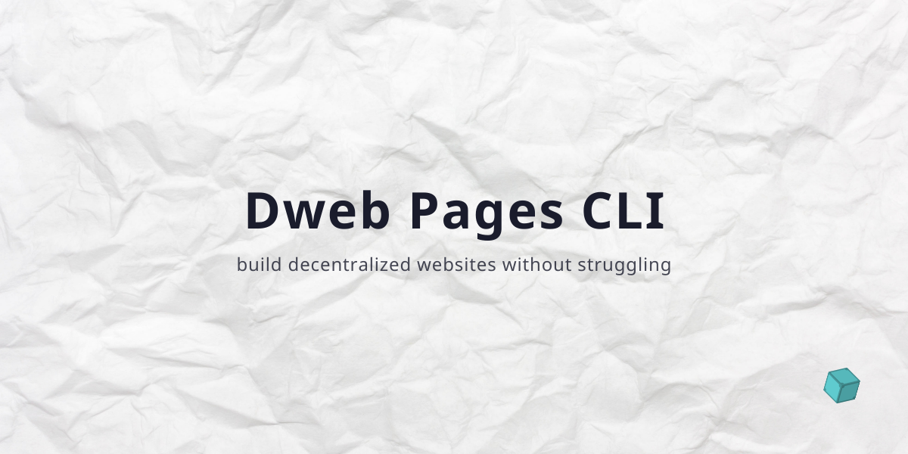

# Dweb Pages CLI

## Install
All binaries can be found at our [GitHub Release Page](https://github.com/alexanderschau/dweb-pages-cli/releases), but you can also use our install script to install or update the tool.
```sh
curl https://pages.dweb.party | sh
```
> If you don't have root privileges, add `sudo` in front of the `sh` command.
## Usage
### Initialize a new project
To start a new project simply type:
```sh
dweb-pages init
```
This will guide you through the setup process. The tool will then automatically create a new subdirectory called `.dweb-pages`. This is the place, where all settings and files related to Dweb Pages are stored.
### Add a version
The versioning system of Dweb Pages is inspired by Git. Like there, you can create multiple "branches" and "commits".

To add a new version run the following command:
```sh
dweb-pages add -t default -t main/latest -t main/v2
```
For each deployment you can add as much tags, as you want.
### Remove a tag
```sh
dweb-pages rm -t main/v2
```
## Special Tags
There are some special tags, which you should only use in the following manner:
|Tag name|Description|
|-|-|
|default|This should point to the latest production build of your app.|
|`<branch-name>`/latest|`latest` represents the latest version of a branch.|

Please keep in mind, that you don't have to follow this rules. However to be compatible with extending services and further features, it's highly recommended.
## Extended features
### Postprocessing script
Each time the CID changes, `dweb-pages` calls the `.dweb-pages/then.sh` script (if it exists).

This can be used to update a remote/local pin or change a DNS record.
> Inside the `then.sh` script you can access the `currentCID` environment variable with the latest CID of the project repo.
## Use cases
- Personal blog
- Project documentation
- App developement

... and many more